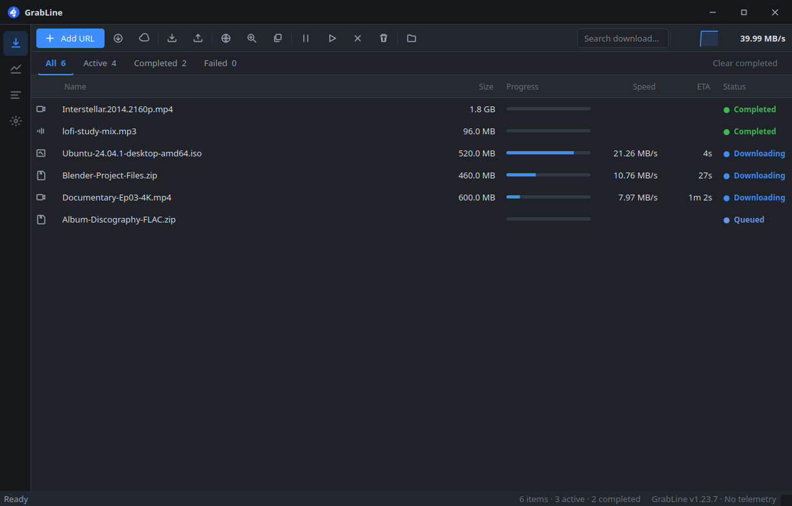
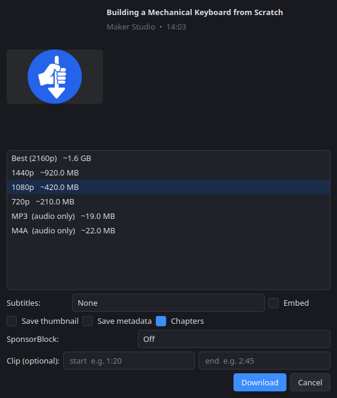
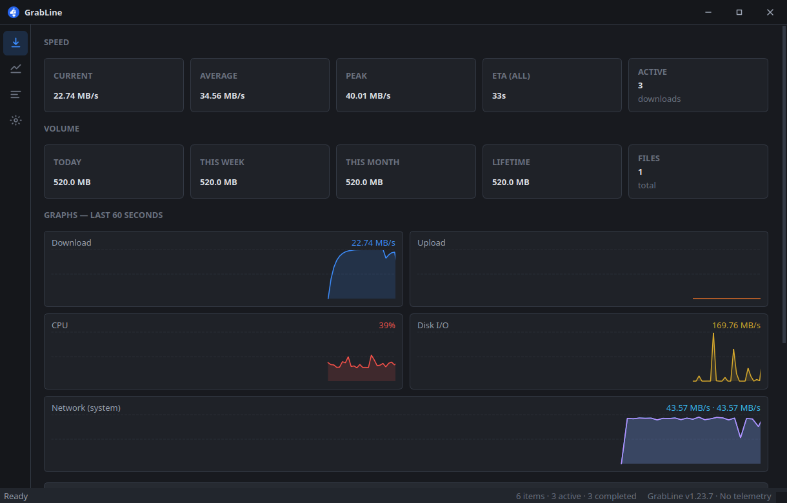

<div align="center">


# GrabLine

**One file. Many lines. Done sooner.**

Free, open-source download manager for Windows, macOS and Linux.
Splits each transfer across parallel connections, resumes after a crash, and pairs with your browser when you want a quality pick.

[![Download][download-badge]][releases]
[![Firefox Add-on][amo-badge]][amo]
[![License: AGPL-3.0][license-badge]][license]
![Platforms][platform-badge]
[![Tests][ci-badge]][ci]

**[Download][releases]** · **[Website](https://gr33nops.github.io/Grabline/)** · **[Firefox add-on][amo]** · [Install guide](docs/install.md)



</div>

[releases]: https://github.com/Gr33nOps/GrabLine/releases/latest
[amo]: https://addons.mozilla.org/en-US/firefox/addon/grabline-connect/
[license]: LICENSE
[ci]: https://github.com/Gr33nOps/GrabLine/actions/workflows/ci.yml
[download-badge]: https://img.shields.io/github/v/release/Gr33nOps/GrabLine?label=Download&color=0170fd&sort=semver
[amo-badge]: https://img.shields.io/amo/v/grabline-connect?label=Firefox%20Add-on&color=ff7139
[license-badge]: https://img.shields.io/badge/License-AGPL--3.0-blue
[platform-badge]: https://img.shields.io/badge/Platform-Windows%20%7C%20macOS%20%7C%20Linux-lightgrey
[ci-badge]: https://img.shields.io/github/actions/workflow/status/Gr33nOps/GrabLine/ci.yml?branch=main&label=tests

---

Paste a URL, drop one on the window, or click the GrabLine button in your browser.
Files run over many connections (up to 128). Videos and audio open a quality panel — 4K to 144p, MP3/M4A/FLAC, subtitles, trim — on 1000+ sites via yt-dlp. Magnets, `.torrent` files, SFTP/FTP/S3/WebDAV, and public Drive/Dropbox links open in the same app.

No ads. No paid tier. No usage telemetry to us. AGPL-3.0.

<p align="center">
  
  &nbsp;&nbsp;
  
</p>

## What you get

- **Accelerator** — up to 128 connections per file, dynamic segmentation, HTTP/2, resume that survives `kill -9`, mirror failover.
- **Browser button** — hover media or right-click links; handoff over Native Messaging (no open ports).
- **Video & audio** — yt-dlp in-process: quality picks, playlists, SponsorBlock, chapters, clip trim.
- **Torrents** — libtorrent (same engine family as qBittorrent): magnets, DHT, sequential streaming, seed ratios, RSS.
- **Cloud** — SFTP/FTP/S3/WebDAV with OS keychain secrets; Drive/Dropbox share links as direct downloads.
- **Queue control** — named queues, schedules, priorities, dependencies, category auto-sort.
- **Network** — HTTP/HTTPS/SOCKS proxies for downloads and torrents; global, per-job and per-host caps.
- **Dashboard** — live speed, totals, graphs for download/upload/CPU/disk/network.
- **Advisory security** — checksums and optional scans warn; they never quarantine your file.

<details>
<summary><b>Engine and network detail</b></summary>

- Dynamic segmentation: a free connection steals work from the slowest one.
- Checkpointed progress across power loss and VPN reconnects; retry-forever option.
- Per-host speed buckets so one greedy site cannot starve the rest.
- Polite mode eases off when you need the link for something else.
- Battery pause and “shut down when done” for overnight batches.

</details>

<details>
<summary><b>Browser extension (GrabLine Connect)</b></summary>

- Firefox: signed on [AMO][amo].
- Chrome / Edge / Brave / others: pair from **Browser Setup** inside the app.
- Hover button, right-click download, per-tab sniffed streams, optional download takeover (off by default on some paths; see the in-app toggles).

</details>

## Download & install

Get the latest files from the **[releases page][releases]**. No Python required for the packaged builds.

| System | File | Notes |
|---|---|---|
| **Windows** | `Grabline-Setup-*.exe` | Or `*-windows-portable.zip` without admin rights. |
| **macOS** | `Grabline-*-applesilicon.dmg` | Apple Silicon (M1+). |
| **Linux** | `grabline_*_amd64.deb` / `*.AppImage` / `*.tar.gz` | `.tar.gz` when FUSE is missing. |

Builds are **unsigned**, so the OS warns once — [docs/install.md](docs/install.md) has the exact clicks. Then install the extension (Firefox from AMO; other browsers from the app’s Browser Setup).

## Everyday use

| You do | GrabLine does |
|---|---|
| Hover a video → GrabLine button | Opens Download Info: name, folder, quality (Best / 1080p / MP3 / …). |
| Right-click → *Download with GrabLine* | Routes to the right engine. |
| Paste or drop a URL | Queues (or opens the quality panel for smart sites). |
| Select a row | Details drawer: speed graph, ETA, destination. |
| ⋯ → Grab Site / Import Links | Crawl a page or expand `file[1-100].jpg` patterns. |

## Honest limits

- **No DRM circumvention.** Netflix, Prime, Disney+, Spotify tracks, etc. are refused clearly.
- **No login bypass.** Optional “use my browser session” reads *your* cookies for *your* downloads; they are not uploaded to us.
- You are responsible for site terms and local law.

## Docs

| Doc | What |
|---|---|
| [Install](docs/install.md) | Per-OS steps, unsigned warnings, data locations, uninstall |
| [Performance](docs/performance.md) | Idle CPU and startup numbers |
| [Security model](docs/security-model.md) | Trust boundaries and enforced checks |
| [SECURITY.md](SECURITY.md) | How to report a vulnerability |
| [PRIVACY.md](PRIVACY.md) | What stays local and what touches the network |
| [Extension](extension/README.md) | GrabLine Connect |
| [Packaging](packaging/README.md) | How installers are built |

## For developers

```bash
git clone https://github.com/Gr33nOps/GrabLine.git && cd GrabLine
python3 -m venv .venv && source .venv/bin/activate   # Windows: py -m venv .venv
pip install -e ".[dev]"
python -m app
```

```bash
ruff check . && ruff format --check . && mypy app && pytest
```

```
app/
├── core/        resolver, segmented downloader, queue, settings, FFmpeg manager
├── engines/     smart (yt-dlp) · hls · torrent · cloud · manifest
├── db/          SQLite jobs, segments, handoffs
├── ui/          PySide6 shell, panels, design tokens
├── native_host/ Native Messaging host
└── tests/       media server, engines, kill -9 resume milestone
extension/       MV3 companion
packaging/       PyInstaller + OS installers
```

Ground rules enforced in CI: no `shell=True`, Native Messaging only (no listen port), FFmpeg/Deno downloads pinned by SHA-256.

## License

[AGPL-3.0](LICENSE). yt-dlp (Unlicense) and PySide6 (LGPL) are compatible dependencies; FFmpeg is fetched on the user’s machine when needed and is not shipped inside the installers. See [PRIVACY.md](PRIVACY.md).
